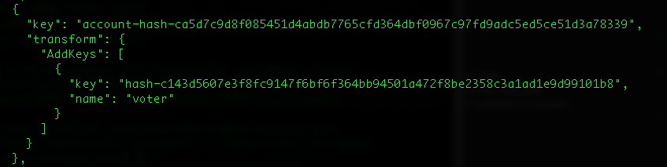

# Voter Smart Contract

投票を行うことができるスマートコントラクトです。

Named keyとして、事前にALICE, BOB, CHARLIEの3人を作成しました。

## Rust toolchainのセットアップ
```bash
$ make prepare
```

## スマートコントラクトのコンパイル
```bash
$ make build-contract
```

## 動作確認 (NCTL)

NCTL(casper-net-1)にスマートコントラクトをデプロイし、動作確認を行います。

### 1. スマートコントラクトのデプロイ

```bash
$ casper-client put-deploy --node-address http://localhost:11101 --chain-name casper-net-1 --secret-key /casper-nctl/assets/net-1/faucet/secret_key.pem --payment-amount 50000000000 --session-path /voter/target/wasm32-unknown-unknown/release/voter-define.wasm
```

### 2. スマートコントラクトのデプロイが成功したかを確認

スマートコントラクトのデプロイが成功したかを確認し、後ほど使用するContract Hashを取得します。

```bash
$ casper-client get-deploy --node-address http://localhost:11101 $Session_hash
```

execution_insfoの中の、"voter"という名前がついたkeyがContract Hashです。



### 3. 票数のインクリメント

--session-argで"ALICE"を指定し、ALICEの票数をインクリメントします。

```bash
$ casper-client put-deploy --session-entry-point "voter_inc" --session-name "voter" --session-arg=candidate_name:"string='ALICE'" --payment-amount 500000000 --chain-name casper-net-1 --node-address http://localhost:11101 --secret-key /casper-nctl/assets/net-1/faucet/secret_key.pem
```

### 4. 上記のput-deployが成功したかを確認

```bash
$ casper-client get-deploy --node-address http://localhost:11101 $Session_hash
```

### 5. State Root Hashの取得

後ほど必要となる、State Root Hashを取得します。

```bash
$ casper-client get-state-root-hash --node-address http://localhost:11101 | jq -r
```

### 6. 票数がインクリメントされていることを確認

ALICEの票数がインクリメントされていることを確認します。

```bash
$ casper-client query-state --node-address http://localhost:11101 -k <ContractHash> -s $STATE_ROOT_HASH -q "voter/ALICE" | jq -r
```

